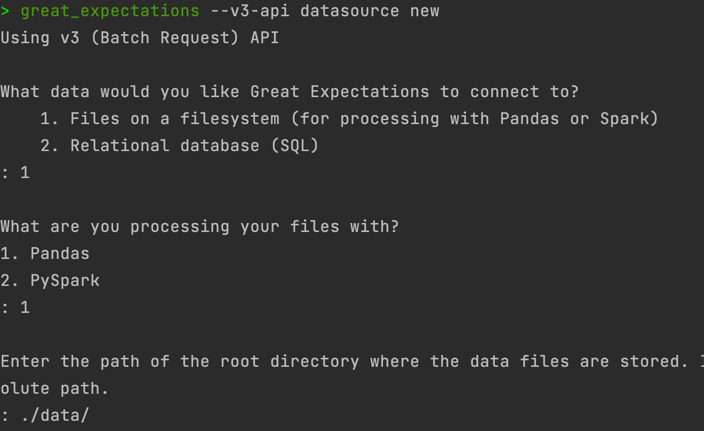
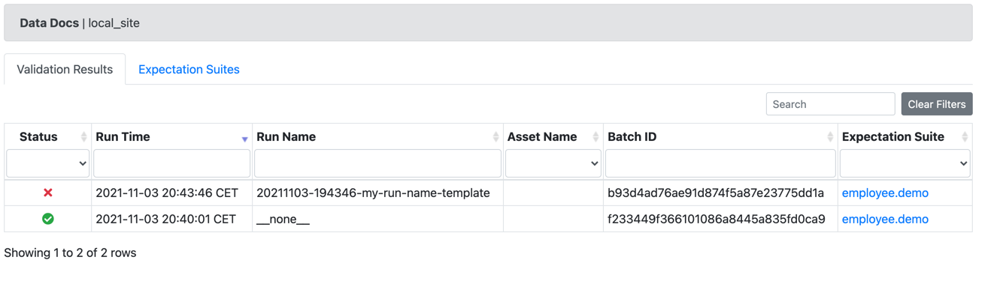

https://github.com/great-expectations/great_expectations

## Table des matières

* [101](#101)
* [Usecases](#usecases)
* [Pros & Cons](#pros-cons)
* [Solutions équivalentes](#solutions-équivalentes)


## 101

Great Expectations est une solution open source qui permet :
+ De documenter 📝 sa donnée
+ De génèrer des rapports sur la qualité 
+ De tester le format d'entrée et de sortie

Fonctionnalités :
-----------------

S'inspirer de ce lien : https://docs.greatexpectations.io/docs/why_use_ge

## Usecases

Les usescases qu'on a retenu :
------------------------------

Toto


Pour les curieux :
------------------

Liens d'articles


## En pratique

Installation :
--------------

**Via pip :**

```
pip install great_expectations
```

Création d'un contexte de donnée:
---------------------------------

Un `Data context` permet de configurer great-expectations avec son projet.

Pour cela il faut lancer :

```
great_expectations --v3-api init
```

Ca crée une arborescence :

```
great_expectations
├── checkpoints
├── expectations
├── great_expectations.yml  # Contient les confirgurations principales 
├── plugins
│         └── custom_data_docs
│             ├── renderers
│             ├── styles
│             │         └── data_docs_custom_styles.css
│             └── views
└── uncommitted
    ├── config_variables.yml
    ├── data_docs
    └── validations
```

Sources de données:
-------------------

Une fois l'initialisation du `data context` faite, il va falloir connecter des sources de données.
On va alors utiliser le `datasource` cli que propose great-expectations pour se brancher à une source.

```
great_expectations --v3-api datasource new
```

En lançant cette commande, un cli intéractif va être lancé pour choisir :
+ La source de données : file system ou Relational db 
+ Le type de traitement : Pandas ou PySpark


> Il existe une listes de data sources présentent sur :   
> https://legacy.docs.greatexpectations.io/en/latest/guides/how_to_guides/configuring_datasources.html


Une fois cela choisi, great-expectations va lancer un jupyter notebook prérempli pour générer automatiquement le fichier de config `great_expectations.yml`.
Après l'avoir modifié/exécuté vous pouvez le supprimer et votre fichier de configs sera pré-rempli.

💡 Vous n'êtes pas obligé de passer par le cli et le notebook vous pouvez directement modifier le fichier `great_expectations.yml`.

Notre attente:
--------------

Après avoir crée une `datasource` on va crée notre première `expectation`.
Ce sont des assertions (tests) à appliquer sur nos données.

On peut utiliser le cli :

**pour initialiser** 

```
great_expectations --v3-api suite new
```

**pour éditer**
```
great_expectations suite edit ${LE_NOM_DE_VOTRE_ATTENTE}
```

Une fois le notebook modifié et éxécuté, nous avons un rapport de tests + documentation `Data Docs`.

## point de contrôle

Une fois qu'on a crée une attente à un instant t sur nos données, et qu'on veut en relancer une nouvelle sur des données plus fraiche.
On peut utiliser ``checkpoint``:

```
great_expectations --v3-api checkpoint new my_new_checkpoint
```

Si la nouvelle donnée ne correspond pas avec les attentes alors le test passe au rouge.

## Pros & Cons

✅ Pros:
--------

Ce que ça apporte

❌ Cons:
--------

Les limites


Roadmap:
========

Communauté ou roadmap

## Solutions équivelentes:

D'autres solutions
